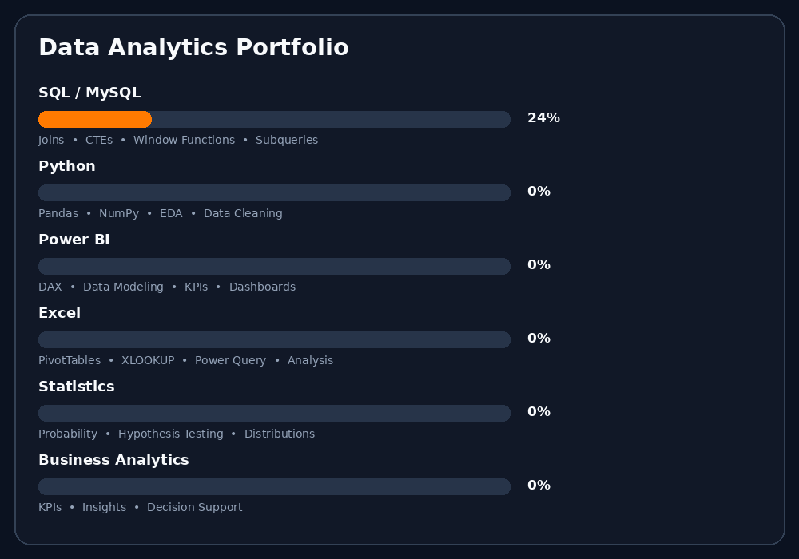

# 👋 Hi, I'm Mukteswar Nayak

**Data Analyst | Business Analytics | Power BI | SQL | Python**

I transform raw data into meaningful insights using Python, SQL, and Power BI. My focus is on data cleaning, exploratory analysis, visualization, and driving business decision-making. I actively tackle complex SQL and algorithmic challenges to build optimal, highly efficient data solutions.

## 👨‍💻 About Me

* 📊 Analyze datasets to uncover meaningful business insights and patterns.
* 🐍 Use Python for data cleaning, advanced analysis, and visualization.
* 🗄️ Write optimized SQL queries for extracting, transforming, and analyzing data.
* 📈 Build interactive and dynamic enterprise-level dashboards using Power BI.
* 🧹 Transform raw and messy datasets into clean, analysis-ready data.
* 💡 Convert analytical findings into clear, actionable business recommendations.

## 📊 Data Analytics Portfolio

  <picture>
    <source
      media="(prefers-color-scheme: dark)"
      srcset="./profile/skills-dark.gif"
    />
    <source
      media="(prefers-color-scheme: light)"
      srcset="./profile/skills-light.gif"
    />
    
  </picture>

## 🛠️ Tech Stack

### 🐍 Programming & Data Analysis

### 🗄️ Databases & SQL

### 📊 Business Intelligence & Visualization

### 🔧 Development & Collaboration

## 📚 Currently Learning

* 📌 Advanced SQL & Window Functions
* 📌 Power BI & DAX
* 📌 Data Modeling
* 📌 Business Statistics
* 📌 Advanced Data Visualization
* 📌 Business Analytics
* 📌 Data Storytelling
* 📌 PL-300 / Power BI certification preparation

## 📊 GitHub Statistics & Streak

  
  

  <strong>🔥 227 GitHub Contributions • Analytics Projects • SQL Practice • Case Studies</strong>

## 🕹️ Contribution Arcade

  <picture>
    <source
      media="(prefers-color-scheme: dark)"
      srcset="https://raw.githubusercontent.com/Mukteswarnayak17/Mukteswarnayak17/output/pacman-contribution-graph-dark.svg"
    />
    <source
      media="(prefers-color-scheme: light)"
      srcset="https://raw.githubusercontent.com/Mukteswarnayak17/Mukteswarnayak17/output/pacman-contribution-graph.svg"
    />
    
  </picture>

## 🤝 Let's Connect & Collaborate

> "Data is just noise until you tell its story."

I am always excited to connect with **fellow data enthusiasts, analysts, engineers, and tech innovators.** Whether you'd like to discuss data visualization techniques, collaborate on open-source analytics projects, explore complex SQL optimizations, or simply say hello—my inbox is always open!

  
  
  
  

 

  

